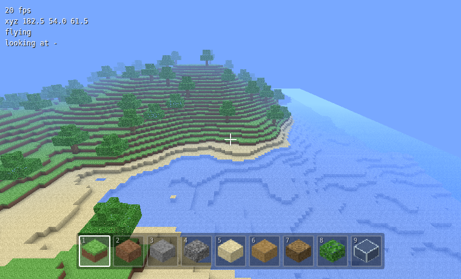

# fake-minecraft-

A small voxel sandbox that runs in the browser. No build step, no dependencies —
two files and raw WebGL.



## Play

Open `index.html` in a browser. If your browser blocks `file://` scripts, serve
the folder instead:

```sh
npx serve .        # or: python3 -m http.server
```

Then open the printed URL and click **Play** to lock the pointer.

## Controls

| | |
|---|---|
| `W` `A` `S` `D` | move |
| Mouse | look |
| `Space` | jump / swim up / fly up |
| `Shift` | sneak / fly down |
| `Ctrl` | sprint |
| `F` | toggle flying |
| Left click | break block |
| Right click | place block |
| `1`–`9`, scroll | choose block |
| `Esc` | pause |

## What's in there

- **World** — 192 × 192 × 64 blocks, generated from value-noise fbm: hills,
  mountains, oceans, beaches, carved caves and oak trees. Each world is
  re-centred on sea level so no seed comes out as pure ocean or pure plateau.
- **Rendering** — the world is split into 16 × 16 chunks, each meshed into a
  single vertex buffer with hidden faces removed and per-vertex ambient
  occlusion. Transparent blocks (water, glass) mesh into a second buffer drawn
  after the solid pass. Distance fog matches the sky, and turns short and murky
  underwater.
- **Textures** — the 4 × 4 atlas is painted pixel by pixel at startup, so there
  are no image assets to load.
- **Physics** — swept AABB collision resolved one axis at a time, gravity,
  jumping, swimming and a flight mode.
- **Editing** — a DDA voxel raycast picks the block under the crosshair; broken
  or placed blocks remesh only the chunks they touch.

## Layout

| file | what it holds |
|---|---|
| `index.html` | canvas, HUD, pause menu, styles |
| `game.js` | math, blocks, atlas, terrain, meshing, renderer, player, input |
