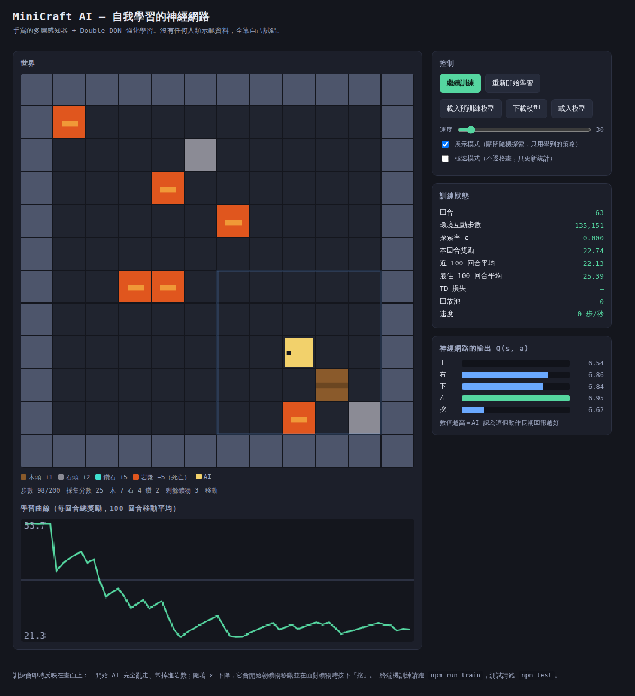
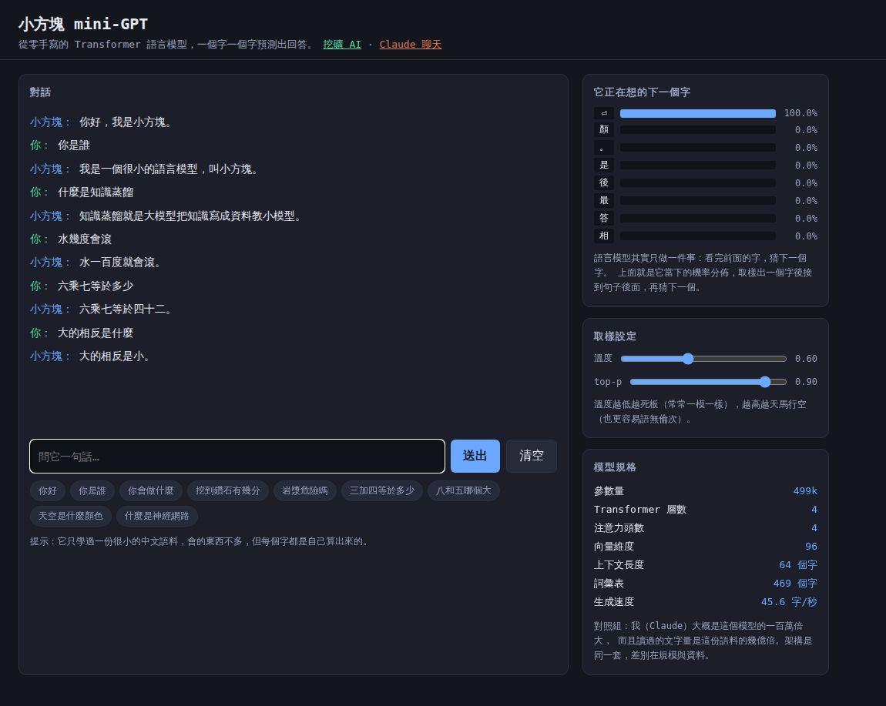
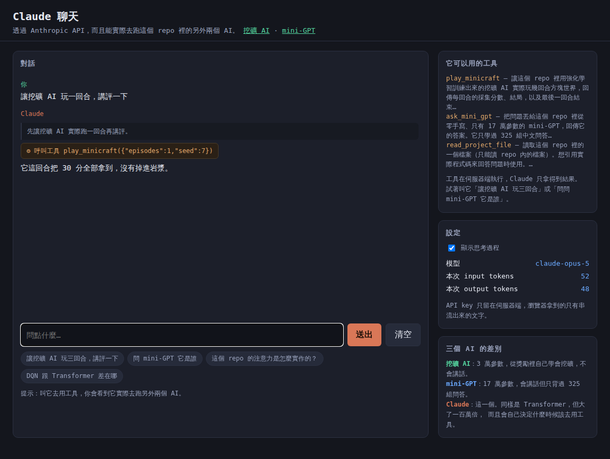

# MiniCraft AI — 兩個從零手寫的 AI

這個 repo 有三個 AI，從「自己從零長出來的」到「真的很聰明的」：

| | 是什麼 | 參數量 | 相依套件 |
| --- | --- | --- | --- |
| 1 | **[會自我學習的挖礦 AI](#minicraft-ai--會自我學習的神經網路)** — 手寫神經網路 + Double DQN 強化學習 | 3.4 萬 | 零 |
| 2 | **[小方塊 mini-GPT](#小方塊-mini-gpt--從零手寫的語言模型)** — 手寫 Transformer 語言模型，語料由 Claude 蒸餾而來 | 49.9 萬 | 零 |
| 3 | **[Claude 聊天](#claude-聊天--會用工具去跑另外兩個-ai)** — 透過 Anthropic API，而且能實際去跑上面那兩個 | 幾千億 | `@anthropic-ai/sdk` |

前兩個是從零手寫的，連反向傳播都自己推；第三個是實話：真正的智慧買不到捷徑，
要嘛用別人訓練好的模型，要嘛準備幾萬張 GPU。

---

# MiniCraft AI — 會自我學習的神經網路

在一個方塊世界裡，一個 AI 從**完全不會動**開始，靠自己反覆試錯，學會走路、朝礦物前進、面對礦物時揮鎬子，並且躲開岩漿。

* 神經網路是**從零手寫**的：矩陣運算、ReLU、反向傳播、Adam 最佳化器，全部自己實作，**零外部相依**。
* 學習方式是**強化學習（Double DQN）**：沒有任何人類示範資料、沒有標準答案，只有「做了什麼 → 得到多少獎勵」。
* 打開瀏覽器就能**即時看它變強**：世界畫面、學習曲線、神經網路當下輸出的 Q 值全部同步顯示。

```
# # # # # # # # # # # #      W 木頭 +1     ~ 岩漿 −5（死亡）
# · ~ · · · W S · · D #      S 石頭 +2     @ AI
# · · D · @ · · · · · #      D 鑽石 +5
# · · · · · · W · · · #
```



## 快速開始

```bash
npm test          # 跑測試（含反向傳播的數值梯度驗證、學習能力驗證）
npm run web       # 開瀏覽器版：http://localhost:8080
npm run train     # 在終端機訓練 2000 回合，模型存到 models/agent.json
npm run play      # 在終端機觀賞訓練好的 AI 玩
```

不需要 `npm install`，專案沒有任何相依套件。repo 裡已附上訓練好的模型，
所以 `npm run play` 和網頁的「載入預訓練模型」都可以馬上看到成果，不必等訓練。

## 這個 AI 到底「學」了什麼

它每一步只看得到這些資訊（162 維向量）：

| 內容 | 維度 | 說明 |
| --- | --- | --- |
| 5×5 視野的方塊種類 | 150 | 以自己為中心，每格 6 種方塊的 one-hot |
| 面向 | 4 | 上／右／下／左 |
| 背包 | 3 | 木、石、鑽的數量（正規化） |
| 進度 | 2 | 剩餘步數比例、剩餘礦物比例 |
| 「指南針」 | 3 | 最近礦物的相對方向與距離 |

輸出是 5 個動作的 Q 值（上、右、下、左、挖）。**沒有人告訴它「看到鑽石要挖」**——
它只是不斷發現「在某些狀態下按『挖』，之後拿到的分數比較高」，然後把這個規律壓進神經網路的權重裡。

環境規則：

| 事件 | 獎勵 |
| --- | --- |
| 挖到木頭 / 石頭 / 鑽石 | +1 / +2 / +5 |
| 走進岩漿 | −5，回合直接結束 |
| 撞牆、對空氣揮鎬子 | −0.05 |
| 每走一步 | −0.02（逼它別磨蹭） |
| 把礦物清光 | +5 |

每一回合地圖都重新隨機生成，所以 AI 不可能靠「背地圖」得分，只能學到通則。

## 學習演算法

```
        ┌──────────────┐   動作 a    ┌──────────────┐
        │  神經網路     │ ──────────► │   方塊世界    │
        │  Q(s, a)     │ ◄────────── │  MiniCraft   │
        └──────────────┘  s', 獎勵 r  └──────────────┘
               ▲                             │
               │  抽樣一批舊經驗              ▼
        ┌──────┴───────────────────────────────────┐
        │ 經驗回放池 (s, a, r, s', done) × 50,000   │
        └──────────────────────────────────────────┘
```

用到的關鍵技巧，都在 `src/agent.js` 裡：

* **經驗回放（Replay Buffer）**：把過去五萬筆經驗存起來隨機抽樣，打散資料的時間相關性。
* **目標網路（Target Network）**：另一份定期同步的網路來算學習目標，避免「自己追自己」而發散。
* **Double DQN**：線上網路挑動作、目標網路評分，抑制 Q 值高估。
* **ε-greedy 探索**：ε 從 1.0 線性降到 0.05，前期什麼都試，後期照學到的策略走。
* **Huber 損失 + 梯度裁剪**：讓 TD 誤差偶爾很大的時候訓練不會炸掉。
* **位能式獎勵塑形**：靠近礦物給一點點甜頭，加速收斂；這種形式在理論上不會改變最佳策略。

TD 學習目標就是這一行（`src/agent.js`）：

```js
const bootstrap = done ? 0 : gamma * qTarget[bestActionFromOnlineNet];
target[action] = reward + bootstrap;   // 貝爾曼方程
```

## 訓練結果

12×12 地圖、16 個礦物（滿分 30）、每回合上限 200 步，單執行緒 CPU，訓練 1500 回合約 20 分鐘
（約 250 環境步／秒）：

| 回合 | 100 回合平均獎勵 | AI 這時候在做什麼 |
| --- | --- | --- |
| 100 | −2.96 | 幾乎是亂走，常常掉進岩漿 |
| 300 | +3.13 | 開始會朝礦物移動 |
| 500 | +18.25 | 學會面對礦物才按「挖」 |
| 900 | +28.15 | 大多數回合把礦物清光 |
| 1500 | **+30.00** | 幾乎每一回合都全清 |

關閉隨機探索後的貪婪策略評估（50 回合，全新隨機地圖）：

```
平均採集分數 26.96／30 | 平均獎勵 27.55 | 全清率 80% | 掉進岩漿的機率 0%
```

訓練好的模型已經放在 `models/agent.json`（309 KB）。網頁上按「載入預訓練模型」就能直接看它挖礦，
終端機則是 `npm run play`。

> `src/play.js` 預設保留 ε=0.02 的隨機性（原始 DQN 論文評估時也是這麼做）：
> 100% 貪婪的策略偶爾會在原地繞圈卡死，一點點雜訊就能把它推出死結。

## 檔案結構

| 檔案 | 內容 |
| --- | --- |
| `src/nn.js` | 手寫神經網路：Dense 層、ReLU/tanh、反向傳播、Adam、Huber 損失、存讀檔 |
| `src/env.js` | MiniCraft 方塊世界：地圖生成、動作、獎勵、觀測向量、ASCII 畫面 |
| `src/agent.js` | Double DQN agent：經驗回放、目標網路、ε-greedy、一次完整的梯度更新 |
| `src/train.js` | 終端機訓練迴圈與評估 |
| `src/play.js` | 載入模型，在終端機觀賞 AI 玩 |
| `tests/run.mjs` | 測試：數值梯度驗證、XOR、環境規則、學習能力、序列化 |
| `index.html` / `web/app.js` | 瀏覽器即時視覺化 |
| `server.mjs` | 最小靜態伺服器（ES module 不能用 `file://` 載入） |
| `models/agent.json` | 已經訓練 1500 回合的模型權重，可直接載入 |

## 測試

`npm test` 會做五組檢查，其中最關鍵的是**用數值微分逐一驗證每個參數的解析梯度**——
反向傳播只要有一個符號寫錯，整個學習就是假的：

```
[1] 反向傳播 vs 數值梯度
  ✓ 所有參數的解析梯度與數值梯度相符  最大相對誤差 3.65e-9
[4] Agent 自我學習（比隨機亂走好）
  ✓ 訓練後的平均採集分數明顯高於隨機策略  隨機 1.55 → 學習後 4.15
```

## 知識蒸餾：Claude 當老師寫資料，小模型當學生吞

「把大模型的學習資料給小模型吞」這件事，正確的做法叫**知識蒸餾**：老師模型沒辦法把
權重或原始語料交出來，但它可以**把知識寫成學生讀得懂的訓練資料**。這個 repo 裡：

* `src/gpt/knowledge.js` — Claude 離線寫好的 167 組知識問答（時間、天文、自然、動物、
  身體、生活、反義詞、地理、AI 概念），刻意壓短答案、重複用字，小模型才吞得下。
* `src/gpt/distill.js` — 有 API key 時，直接叫 Claude 大量生成問答：結構化輸出
  （`output_config.format`）保證格式，再自動濾掉太長、含英數字、重複的資料。

```bash
node src/gpt/distill.js --topics 生活常識,簡單科學 --perTopic 60
node src/gpt/train.js --data data/distilled.txt --steps 4000 --block 64
```

### 實測：吞更多資料，它真的變聰明了嗎？

語料從 325 組擴到 584 組（+80%），詞彙表 221 → 469 字，然後跑對照實驗：

| 模型 | 參數量 | 語料 | 訓練步數 | 逐字答對率 |
| --- | --- | --- | --- | --- |
| 原版 | 16.7 萬 | 325 組 | 3000 | 99.4% |
| A：同樣大小，吞新語料 | 18.4 萬 | 584 組 | 3500 | **99.3%** |
| B：3 倍大，但只訓練一半 | 49.9 萬 | 584 組 | 1600 | 87.7% |
| B：3 倍大，訓練步數相同 | 49.9 萬 | 584 組 | 3500 | **99.8%** |

三個發現，其中一個推翻了我原本的猜測：

1. **同樣大小的模型多吞 80% 的知識，正確率完全沒掉**（99.4% → 99.3%）。
   我原本預期容量會先撐不住，結果在這個規模下還遠遠沒到極限——這是實測打臉猜測。
2. **模型變大但訓練不夠，反而更差**（87.7%）。錯誤長這樣：「我很小，只學過一點點點東西。」
   ——它在重複字，是典型的訓練不足。參數變多就需要更多步數，不是免費的。
3. **步數拉到一樣之後，大模型把算術錯誤全修好了**：小模型會系統性答錯減法
   （「九減八等於二」），大模型加減乘 327 題全對。這說明那些錯不是「粗心」，
   是容量不夠時模型只能抓個大概的字形規律。

### 所以「把你的學習資料給它吞」到底行不行

| 問題 | 答案 |
| --- | --- |
| 能不能拿到大模型的訓練資料？ | **不能。** 那不是一個檔案，模型本身也拿不到它。 |
| 能不能請大模型寫資料教小模型？ | **可以，而且有效。** 就是上面做的，這是業界標準做法。 |
| 這樣小模型會變得跟大模型一樣聰明嗎？ | **不會。** 它只會這 584 組問答裡的東西。 |

要真的接近大模型的能力，需要的量級是：語料從 40 萬字變成幾兆字（一億倍），
參數從 50 萬變成幾千億（一百萬倍），訓練從一台 CPU 跑 75 分鐘變成幾萬張 GPU 跑幾個月。
蒸餾能把「特定範圍內的行為」搬過去，搬不動的是**通用能力**。

## 可以再玩的方向

* 把 `hidden` 改成 `[256, 256]`，或把視野從 5×5 放大到 7×7。
* 拿掉 `env.js` 裡的「指南針」欄位，改成餵入多幀畫面，讓它自己處理部分可觀測問題。
* 加上優先經驗回放（Prioritized Replay）或 Dueling 架構。
* 把獎勵改成「合成工作台需要 4 個木頭」之類的多階段任務，看它能不能學會工具序列。

---

# 小方塊 mini-GPT — 從零手寫的語言模型

跟我（Claude）**同一套架構**的語言模型：字元級分詞 → 詞嵌入 + 位置嵌入 → 多層 Transformer
（因果多頭自注意力 + 前饋網路 + 殘差 + LayerNorm）→ 預測下一個字。差別只有規模——
它 50 萬參數、讀過 40 萬個字；我是幾千億參數、讀過的文字量是它的幾億倍。

它的訓練語料**是我寫給它的**（[知識蒸餾](#知識蒸餾-claude-當老師寫資料小模型當學生吞)）：
584 組中文問答，涵蓋常識、自然、動物、時間、算術與這個 repo 本身。

```
你：你是誰
小方塊：我是一個很小的語言模型，叫小方塊。
你：挖到鑽石有幾分
小方塊：鑽石是五分。
你：三加四等於多少
小方塊：三加四等於七。
```



```bash
npm run gpt:chat    # 在終端機跟它聊天（repo 附了訓練好的模型）
npm run web         # 開瀏覽器版聊天：http://localhost:8080/chat.html
npm run gpt:train   # 自己重新訓練
```

## 它是怎麼運作的

語言模型只做一件事：**看完前面的字，猜下一個字**。把猜出來的字接到後面，再猜下一個，
就變成一句話。瀏覽器版的右邊會即時顯示它當下的機率分佈，可以直接看到這個過程。

```
輸入： 問 ： 你 是 誰 \n 答 ：
        │                    │
        ▼                    ▼
   [詞嵌入 + 位置嵌入]  ← 每個字變成一個 64 維向量
        │
   ┌────┴─────────────────────────────┐
   │  Transformer 區塊 × 3            │
   │    x = x + 注意力(LayerNorm(x))  │ ← 每個字去看前面所有的字
   │    x = x + 前饋層(LayerNorm(x))  │ ← 再各自做一次非線性變換
   └────┬─────────────────────────────┘
        │
   [LayerNorm → 與詞嵌入共享權重的輸出層]
        │
        ▼
   下一個字的機率分佈 → 取樣 →「我」
```

**因果遮罩**是關鍵：第 t 個位置只能看到第 1..t 個字，看不到未來。所以一次前向傳播就能
同時訓練序列上每一個位置的預測，而且生成時不會作弊。測試裡有一項就是在驗證這件事。

## 每個零件都是自己寫的

| 檔案 | 內容 |
| --- | --- |
| `src/gpt/tensor.js` | 張量自動微分引擎：matmul、LayerNorm、GELU、embedding、**因果多頭自注意力**、交叉熵，每個都自己推導前向與反向 |
| `src/gpt/model.js` | GPT 本體：Pre-LN 殘差區塊、權重共享的輸出層、temperature / top-k / top-p 取樣 |
| `src/gpt/optim.js` | AdamW + 暖身 / 餘弦衰減學習率 |
| `src/gpt/tokenizer.js` | 字元級分詞器 |
| `src/gpt/corpus.js` | 語料組裝：模板題（算術、比大小、顏色…）＋ 蒸餾知識，共 584 組 |
| `src/gpt/knowledge.js` | Claude 寫給小模型的 167 組知識問答（知識蒸餾的老師端） |
| `src/gpt/distill.js` | 用 Claude API 大量生成語料的管線（含清洗與去重） |
| `src/gpt/train.js` / `src/gpt/chat.js` / `src/gpt/eval.js` | 訓練、終端機聊天、逐題評估 |
| `models/gpt.json` | 49.9 萬參數的模型權重（4 MB），網頁與 `gpt:chat` 預設載入這個 |
| `models/gpt-small.json` | 18.4 萬參數的對照模型（1.5 MB） |
| `chat.html` + `web/chat.js` | 瀏覽器聊天，含「下一個字的機率」即時視覺化 |

反向傳播全部是手推的，所以測試裡**每一個運算都用數值微分逐一驗證**：

```
[1] 每個運算的反向傳播 vs 數值梯度
  ✓ matmul / matmulT / addBias / add / gelu / layerNorm / embedding / slice
  ✓ attention（因果多頭自注意力）  最大相對誤差 4.24e-7
[2] 整個 GPT 的梯度
  ✓ 全部 22 組參數的梯度都正確  最大相對誤差 1.23e-7
[3] 因果遮罩：不能偷看未來
  ✓ 改動後面的字不會影響前面位置的輸出  差異 0.0e+0
[5] 真的學得起來：把一小段文字背下來
  ✓ 損失從 ln(V) 降到接近 0  2.613 → 0.0000
  ✓ 能一字不差地背出原句
```

## 訓練結果

4 層 × 4 頭 × 96 維、上下文 64 個字、**49.9 萬參數**；語料 40.4 萬字、詞彙表 469 個字。
單執行緒 CPU 訓練 3500 步（約 75 分鐘）：

| 步數 | 訓練損失 | 驗證損失 |
| --- | --- | --- |
| 0 | 6.23（＝亂猜，ln 469 ≈ 6.15） | 6.20 |
| 1000 | 0.54 | 0.55 |
| 2000 | 0.40 | 0.44 |
| 3500 | **0.41** | **0.40** |

把 584 組問答全部問一遍（`node src/gpt/eval.js`），逐字完全正確的比例：

```
背下來的比例：583/584（99.8%）

  加減 156/156 100%   比大小 90/90 100%   乘法 81/81 100%   聊天 75/76  99%
  數數  27/27  100%   自然   20/20 100%   反義詞 20/20 100%   AI知識 18/18 100%
  顏色  17/17  100%   生活   16/16 100%   動物  15/15 100%   時間   13/13 100%
  天文  11/11  100%   地理    9/9  100%   身體   3/3  100%   方塊世界 12/12 100%
```

唯一答錯的一題是「晚安」少講一個字（「晚安，好休息。」）。

訓練好的模型放在 `models/gpt.json`（4 MB）；同一份語料訓練的小模型（18.4 萬參數）放在
`models/gpt-small.json`，兩個可以互相比較。網頁上直接載入，終端機則是 `npm run gpt:chat`。

## 老實說：它有多笨

- 它只學過那 584 組問答，**問到範圍外的東西就會胡言亂語**。問「宇宙是什麼」它會回
  「手是用來拿東西的。」——這不是 bug，是它真的只有這些資料。
- 它沒有推理能力。算術全對是因為那 300 多組算式它全背起來了，不是真的會加減乘。
  證據：同一份語料下較小的模型會系統性答錯減法（「九減八等於二」），也就是它在模仿
  字的規律，不是在計算。
- 想要真的達到我這種程度，需要的是幾萬張 GPU、幾個月、以及整個網際網路等級的語料——
  那不是能在這個 repo 裡從零跑出來的東西。這個專案能給你的是**完全看得懂的原理**：
  同樣的架構、同樣的訓練目標、同樣的反向傳播，只是縮小了一百萬倍。

---

# Claude 聊天 — 會用工具去跑另外兩個 AI

前面兩個 AI 是「從零長出來的」，這一個是「真的聰明的」：透過 Anthropic 官方 SDK 呼叫
Claude Opus 5，多輪對話、串流輸出、而且**掛了三個工具讓它能實際操作這個 repo**。



```bash
npm install                # 只有這一部分需要相依套件（另外兩個 AI 不用）
export ANTHROPIC_API_KEY=sk-ant-...   # 或先跑 `ant auth login`
npm run claude:chat        # 終端機聊天
npm run claude:web         # 網頁聊天：http://localhost:8081/claude.html
```

## 它能做的事

| 工具 | 它會做什麼 |
| --- | --- |
| `play_minicraft` | 真的叫那個強化學習 AI 去玩幾回合，回傳分數、結局與最後的地圖 |
| `ask_mini_gpt` | 把問題轉給 17 萬參數的 mini-GPT，回傳它（常常很好笑）的答案 |
| `read_project_file` | 讀 repo 裡的原始碼來回答問題（限制在 repo 內，擋掉 `../` 跳脫） |

所以你可以直接說「讓挖礦 AI 玩三回合，講評一下」，它會自己決定要呼叫哪個工具、
看完結果再回答。工具全都在**伺服器端**執行，API key 不會進到瀏覽器。

## 實作重點

```js
// src/claude/session.js —— 工具迴圈交給 SDK 的 tool runner
const runner = client.beta.messages.toolRunner({
  model: 'claude-opus-5',
  thinking: { type: 'adaptive', display: 'summarized' },  // 思考過程也串流出來
  output_config: { effort: 'high' },
  betas: ['server-side-fallback-2026-07-01'],
  fallbacks: 'default',      // 被安全分類器擋下時自動改用備援模型，而不是整個中斷
  tools: ALL_TOOLS,
  stream: true,
});
```

| 檔案 | 內容 |
| --- | --- |
| `src/claude/session.js` | 一輪對話的核心：串流事件解析、工具迴圈、`pause_turn` 續跑、錯誤翻譯 |
| `src/claude/tools.js` | 三個工具的定義與實作、系統提示 |
| `src/claude/chat.js` | 終端機聊天（`/reset`、`/thinking`、`/usage`） |
| `src/claude/server.js` | 網頁版後端：靜態檔案 + `/api/chat` 的 SSE 串流 |
| `claude.html` + `web/claude.js` | 網頁聊天介面，會顯示思考與工具呼叫 |

## 測試（沒有 API key 也能跑）

`tests/claude.mjs` 會**架一個假的 Anthropic API**，回傳跟真的一模一樣格式的 SSE
（含 `thinking_delta`、`tool_use`、`input_json_delta`），再把 SDK 的 `baseURL` 指過去，
藉此驗證整條路徑：

```
[2] 串流 + 工具呼叫的完整迴圈（對著假 API 跑）
  ✓ 串流的文字有逐字收到
  ✓ 有回報工具呼叫  [{"name":"ask_mini_gpt","input":{"question":"你是誰"}}]
  ✓ 工具真的被執行，結果餵回 API  "小方塊回答：我是一個很小的語言模型，叫小方塊。"
  ✓ 回傳的歷史包含工具往返  user,assistant,user,assistant
  ✓ 401 會被翻成看得懂的訊息
```

網頁版也用同一個假 API 做過端對端驗證（瀏覽器裡確認思考區塊、工具晶片、逐字串流、
token 用量都正確）。**但要說清楚：開發這個功能的環境沒有 API key，所以沒有對真正的
Anthropic API 跑過。** 請求的參數形狀是照官方文件寫的，第一次拿你自己的 key 跑之前，
建議先用一句簡單的話測試。
